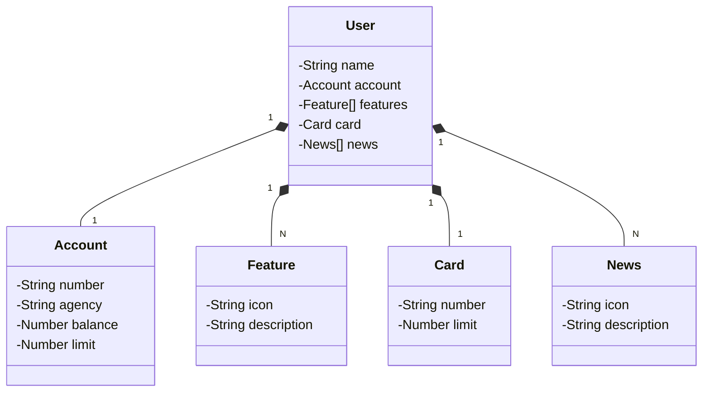

# Santander Dev Week 2024

Java RESTful API criada para a Santander Dev Week.

## Principais Tecnologias
- **Java 21**: Utilizo a versão LTS mais recente do Java para tirar vantagem das últimas inovações que essa linguagem robusta e amplamente utilizada oferece.
- **Spring Boot 3**: Trabalho com a mais nova versão do Spring Boot, que maximiza minha produtividade por meio de sua poderosa premissa de autoconfiguração.
- **Spring Data JPA**: Exploro como essa ferramenta pode simplificar minha camada de acesso aos dados, facilitando a integração com bancos de dados SQL.
- **OpenAPI (Swagger)**: Crio uma documentação de API eficaz e fácil de entender usando a OpenAPI (Swagger), perfeitamente alinhada com a alta produtividade que o Spring Boot oferece.
- **Railway**: Facilita o deploy e monitoramento das minhas soluções na nuvem, além de oferecer diversos bancos de dados como serviço e pipelines de CI/CD.

## [Link do Figma](https://www.figma.com/file/0ZsjwjsYlYd3timxqMWlbj/SANTANDER---Projeto-Web%2FMobile?type=design&node-id=1421%3A432&mode=design&t=6dPQuerScEQH0zAn-1)

Utilizei o Figma para a abstração do domínio desta API, sendo útil na análise e projeto da solução.

## Diagrama de Classes (Domínio da API)

